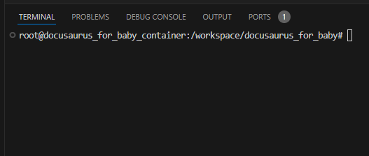

# Docs 1

## Code blocks highlighting

### Kotlin

```kotlin
fun main(args : Array<String>) {
    println("Hello, World!")
}
```

## Typescript

```typescript
import { github_username } from '../common';

export const navbar = {
    // ...
    items: [
        { label: 'Blog 1', to: '/blog1/', position: 'left' },
        { label: 'Blog 2', to: '/blog2/', position: 'left' },
        { label: 'Docs 1', to: "/docs1/", position: 'left' },
        { label: 'Docs 2', to: "/docs2/", position: 'left' },
    ],
};
```

## C#

```csharp
public class Program
{
    public static void Main(string[] args)
    {
        System.Console.WriteLine("Hello, World!");
    }
}
```

## Math Equations

https://docusaurus.io/docs/markdown-features/math-equations

$$
I = \int_0^{2\pi} \sin(x)\,dx
$$

## Search + 中文

https://github.com/easyops-cn/docusaurus-search-local

中文

## Image




